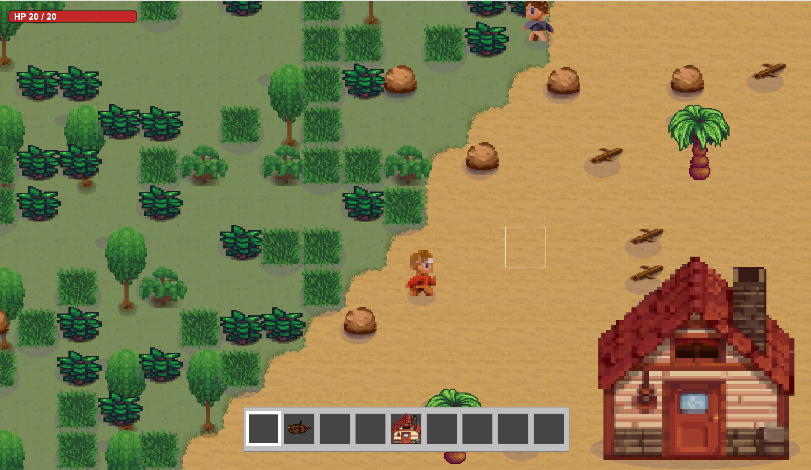
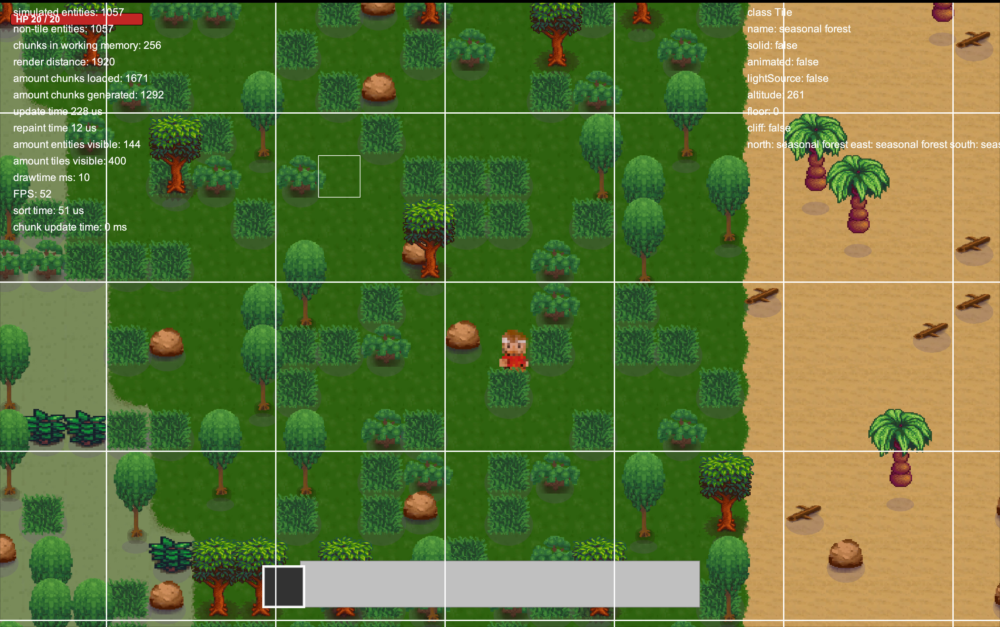
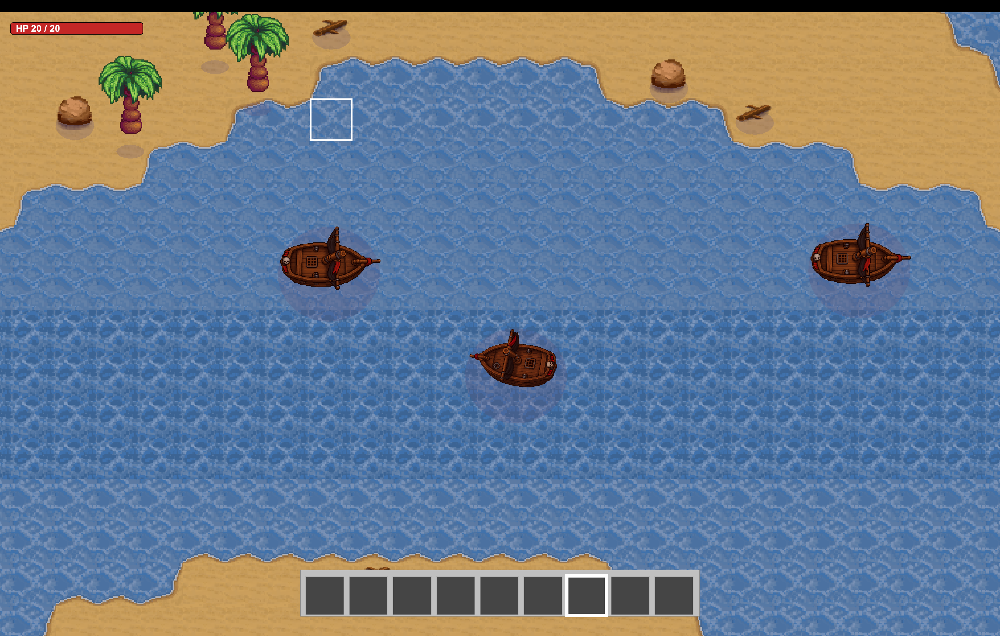

# FarOak

A 2D top-down survival game with a procedurally generated, chunk-streamed world. Explore forest, beach, and ocean biomes, gather resources, fight off pirates, and (soon) sail between islands.



## About the project

- **Pure Java + Swing.** No game engine, no external rendering library — everything from the world generator to the sprite batcher is hand-written. Targets **JDK 17+**.
- **Procedural world.** Infinite chunked terrain with biome blending, altitude-driven beaches/cliffs, and on-the-fly object placement (trees, rocks, shrubs, driftwood, structures). Inlcudes procedural generation of tile sprites.
- **Online multiplayer — coming soon.** Networking scaffolding is in place (see [resources/net/](resources/net/)); the goal is co-op survival on a shared world.
- **Built-in debug overlay** with FPS, chunk counts, entity counts, draw time, and a hovered-tile inspector — useful when tuning generation or performance.




## Setup

Requirements: **JDK 17+**.

### Run from the command line

From the project root:

```bash
find resources -name "*.java" > sources.txt
javac -d out @sources.txt
java -cp out resources.app.Main
```

The working directory must be the project root so `resources/images/...` paths resolve.

### Run from an IDE (IntelliJ / VS Code)

1. Open the project folder (the one containing `resources/`).
2. Mark `resources` as a **sources root** (IntelliJ: right-click → *Mark Directory as → Sources Root*).
3. Set the run configuration's **working directory** to the project root.
4. Run `resources.app.Main` — entry point: [resources/app/Main.java](resources/app/Main.java).
